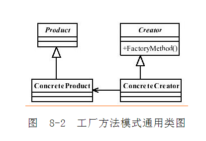

> 注：代码和以下内容总结自《设计模式之禅》一书

##1.工程模式定义
###(1)通用类图

###(2)优缺点
优点：

- a.良好的封装性，代码结构清晰。只要知道产品类名就可以创建，不用知道创建对象的艰辛过程，降低模块间耦合
- b.扩建性好。例如要增加一个棕色人种，只需要增加一个BrownHuman类，工厂类不需要任何修改
- c.屏蔽产品类，产品类的实现如何变化，调用者不必关心
- d.典型的解耦框架。符合迪米特法则（最少知识原则，高层模块知道的越少越好）;符合依赖倒置原则，只依赖产品类的抽象;符合里氏替换原则（父类能出现的地方子类就能出现）
	
###(3)应用场景
- a.在所有需要生产对象的地方都可以使用，但是要慎重的考虑是否要增加一个工场类，增加代码复杂度
- b.需要灵活的，可扩展的框架时。
- c.用在异构项目中。
- d.可以使用在测试驱动开发的框架下。例如，测试一个类A，就需要把与之关联的类B也同时产生出来，我们可以使用工厂方法模式将类B虚拟出来，避免类A与类B的耦合。由于JMock和EasyMock的诞生，该场景已经弱化了，此场景，可以直接考虑使用。
	
###(4)扩展
- a.简单工程模式（静态工程模式），即去掉抽象工程类，将创建方法设置为静态。

缺点：工程类的扩建较困难，不符合开闭原则。
		
- b.多个工厂类。

每个人种对应一个创建类，继承自抽象工程，抽象方法中不需要传递参数。
		
- c.单例工厂，替换单例模式。
		
- d.延迟初始化（lazy initialization）

一个对象被消费完毕后，并不立刻释放，工厂类保持其初始状态，等待再次被使用。可以将对象保存到Map集合中。延迟加载框架的扩展--例如限制某一产品类的最大实例化数量，可以通过判断Map中已有的对象数量来实现。还可以用在对象初始化比较复杂的情况下。
	
###(5)与其他模式的混用

如模板方法模式，单例模式，原型模式等。

	
<link rel="stylesheet" href="https://maxcdn.bootstrapcdn.com/font-awesome/4.4.0/css/font-awesome.min.css">

<i class="fa fa-github fa-4x"></i>

end